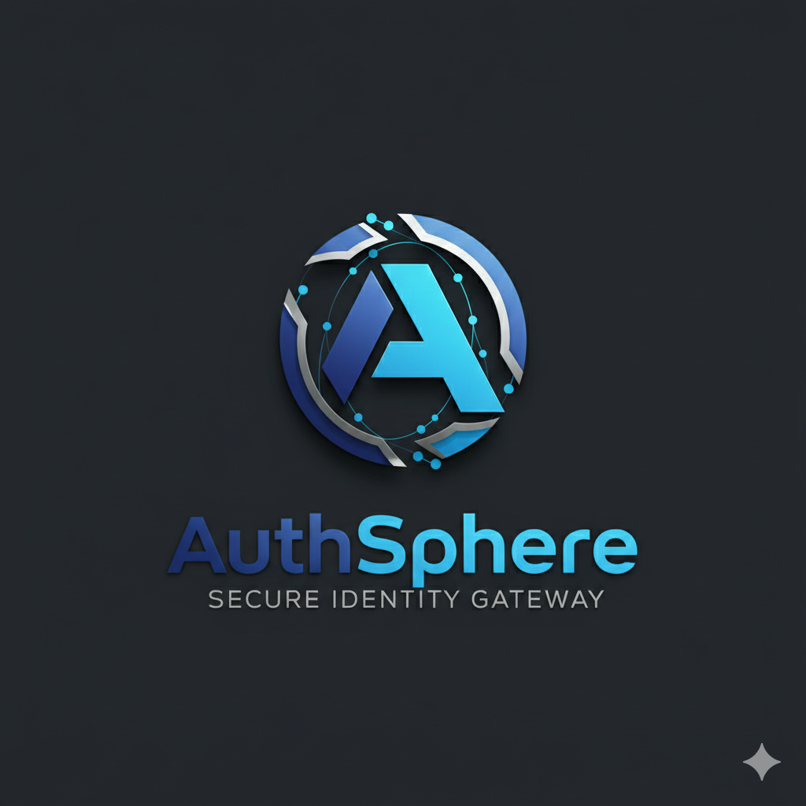

<div align="center">
  
  

# AuthSphere

### **The Next-Generation Identity Orchestration Engine for Modern Platforms**

AuthSphere is an enterprise-grade, high-fidelity **Identity-as-a-Service (IDaaS)** infrastructure. It is meticulously engineered to bridge the gap between complex cryptographic authentication protocols and rapid application development cycles. By abstracting the intricacies of **OAuth 2.0**, **OpenID Connect (OIDC)**, and **PKCE (Proof Key for Code Exchange) flows** into a unified, developer-first orchestration engine, AuthSphere allows engineering teams to deploy world-class security in minutes.

[](https://github.com/madhav9757/AuthSphere)
[](https://www.npmjs.com/package/@authspherejs/sdk)
[](https://github.com/madhav9757/AuthSphere/blob/main/LICENSE)
[](https://auth-sphere-gilt.vercel.app/)
[](https://react.dev/)
[](https://nodejs.org/)

  <p align="center">
    <a href="https://auth-sphere-gilt.vercel.app/">Live Command Center</a> •
    <a href="#-table-of-contents">Comprehensive Docs</a> •
    <a href="#-monorepo-ecosystem-architecture">Architecture</a> •
    <a href="#-the-identity-handshake-oidc--pkce">The Handshake</a> •
    <a href="#-security-posture">Security Spec</a>
  </p>

---

</div>

## 📖 1. The Project Genesis & Core Vision

In the contemporary digital landscape, identity is no longer just a "login form." It is the critical first point of contact, the gatekeeper of user trust, and the foundation of data privacy. Historically, building a robust identity system required months of dedicated engineering time, deep knowledge of cryptographic primitives, and the constant maintenance of obscure RFC standards.

**AuthSphere** was conceived to normalize this complexity. Our mission is to provide an "Identity-in-a-Box" solution that doesn't compromise on professional aesthetics or platform security.

### **The Three Foundational Pillars**

1.  **🛡️ Zero-Trust Security Architecture**: We treat every identity interaction as potentially hostile. From PKCE-enforced redirects to Argon2id password hashing and RSA-signed tokens, we implement security at every layer of the OS stack.
2.  **🎨 Premium Developer Experience (DX)**: We believe that administrative tools should be as beautiful as the products they manage. Our Command Center features high-density analytics, glassmorphic UI elements, and real-time technical telemetry.
3.  **⚡ High-Velocity Integration**: With our type-safe Universal SDK, developers can integrate social auth (Google, GitHub, Discord) and local auth flows with single-digit lines of code.

---

## 🏛️ 2. The Identity Orchestration Philosophy

AuthSphere acts as a **Modern Identity Orchestrator**. Unlike traditional libraries that you import into your server, AuthSphere is a standalone identity authority that manages the entire user lifecycle.

### **Orchestration vs. Simple Auth**

- **Traditional Auth**: Your server handles passwords, handles provider redirects, manages session state, and generates emails. This creates a massive attack surface and tightly couples your business logic to identity code.
- **AuthSphere Orchestration**: Your application (the Relying Party) simply greets the user and hands them off to AuthSphere. We handle the provider handshakes, the cryptographic verification, the OTP (One-Time Password) generation, and the email delivery. Once verified, we hand the user back to you with a cryptographically signed "Proof of Identity" (JWT).

---

## 🏗️ 3. Monorepo Ecosystem Architecture

AuthSphere is organized as a modular, high-performance monorepo, ensuring that every component — from the database schema to the client-side headers — is in perfect semantic sync.

### **📡 A. Core API Engine (`/backend`)**

_The High-Availability Authoritative Heart_
The backend is a robust Node.js / Express engine designed for sub-100ms response times and total multi-tenant isolation.

- **Tenant Vaulting**: Every developer project in AuthSphere is logically and cryptographically isolated. Keys generated for Project A cannot decrypt data for Project B.
- **Protocol Management**: Native implementation of the Authorization Code Flow with PKCE.
- **Cryptographic Services**: Manages the lifecycle of RSA-2048 signing keys and AES-256-GCM metadata encryption.
- **Database Architecture**: Uses Mongoose (MongoDB) with optimized indexing for rapid identity lookups and audit log ingestion.
- **Email Dispatch Hub**: A specialized orchestrator that dynamically generates and sends branded verification emails via SMTP.

### **🎨 Command Center (`/frontend`)**

_The Elite Developer Surface_
A world-class administrative dashboard built on **React 19**. It provides platform engineers with "God Mode" over their identity infrastructure.

- **Design System**: A custom-built Atomic Design system featuring "Glassmorphism" — a style that uses hierarchy, transparency, and background blurs to create depth.
- **Live Telemetry**: A real-time WebSocket-powered terminal that streams authentication events (Login, Token Exchange, Block, Verify) to the dashboard in milliseconds.
- **Identity Vault**: A dense, functional interface for managing end-users, including granular control over verification status and account suspension.
- **Branding Engine**: A real-time previewer for identity emails. What you design in the dashboard is exactly what your users see in their inbox.

### **📦 Universal SDK (`/package`)**

_The Seamless Handshake Automator_
Written in 100% TypeScript, the SDK is the "glue" that allows any frontend application to talk to the AuthSphere engine.

- **Automation**: Handles the generation of high-entropy `code_verifier` and `code_challenge` strings.
- **Persistence**: Manages the secure storage of Access and Refresh tokens, including automated silent-refresh cycles to prevent session drops.
- **Type Safety**: Provides exhaustive IntelliSense for every login flow, error code, and user claim.

### **🧪 Reference Application (`/test`)**

_The Pattern Showcase_
A reference implementation built with React and the AuthSphere SDK. It serves as a living documentation for:

- Implementing Protected Routes using SDK state.
- Handling Social Login redirects and callbacks.
- Designing high-conversion verification flows for local auth.

---

## 🔐 4. Technical Deep Dive: The Security Deck

AuthSphere is built on the philosophy that **Security is Non-Negotiable**.

### **Identity Verification (PKCE S256)**

Standard OAuth2 redirects are vulnerable to "Code Interception Attacks" on public clients like SPAs. AuthSphere solves this by enforcing **PKCE (Proof Key for Code Exchange)**.

1.  **Generation**: The SDK generates a secret `code_verifier`.
2.  **Challenge**: The SDK sends a `code_challenge` (SHA-256 hash of the verifier) to the AuthSphere backend.
3.  **Verification**: Upon return, the SDK sends the raw `code_verifier`. AuthSphere hashes it and compares it to the original challenge. This proves that the recipient of the code is the _exact same_ browser that initiated the request.

### **Cryptographic Integrity & RS256**

Every project on AuthSphere is assigned a unique **RSA-2048** key pair.

- **RS256 Signing**: All issued JWTs are signed using the project's Private Key.
- **Public Verification**: Your application only needs the Project's Public Key (available via the dashboard) to verify the token. This allows for stateless, offline verification that is immune to server-side request forgery (SSRF).

### **Data Encryption at Rest (AES-256-GCM)**

Sensitive project configuration data (like your SMTP passwords or Social Provider Secrets) is never stored in plain text.

- **Authenticated Encryption**: We use AES-256-GCM, which provides both confidentiality and authenticity.
- **Per-Project Nonces**: Every encryption event uses a unique nonce, preventing patterns even when encrypting similar values.

### **Argon2id: Superior Password Hashing**

While legacy platforms use Bcrypt or SHA-256, AuthSphere implements **Argon2id**.

- **Winner of the Password Hashing Competition**.
- **Hardware Resistance**: Designed specifically to be memory-hard and time-hard, making it nearly impossible to crack using GPUs, ASICs, or specialized cracking hardware.

---

## ✨ 5. Feature Suite (Detailed)

### **🚀 Multi-Tenant Project Isolation**

AuthSphere is designed for developers who build multiple products.

- **Switch Contexts**: Instantly jump between your "SaaS Pro" environment and your "Staging Dashboard."
- **Audit Logging**: Every project keeps an immutable log of every change, including who made it, when, and from what IP.

### **🎨 High-Fidelity Branding Engine**

Stop sending generic, untrusted verification emails.

- **Real-Time Architect**: Edit colors, logos, and support links with a live side-by-side preview.
- **Delivery Monitoring**: The dashboard tracks the "Health" of your verification emails, ensuring your users never miss an OTP.
- **Responsive by Default**: Generated emails are tested across Outlook, Gmail, and Apple Mail clients.

### **📊 Live Telemetry & Observability**

The identity telemetry feed is the pulse of your application.

- **Sub-Second Stream**: See logins happen as they occur.
- **Diagnostics**: Debug OIDC handshake failures in real-time without diving into backend logs.
- **Geographic Insights**: Monitor where your traffic is coming from to detect coordinated credential stuffing attacks.

### **👥 Advanced Identity Management**

Most auth providers treat users as "rows in a table." We treat them as "active identities."

- **Account Blocking**: The ultimate security deterrent. Blocking a user immediately invalidates their access across all devices and future login attempts.
- **Verification Overrides**: Manually verify users or trigger re-verification flows from the UI.
- **Permanent Purge**: Compliant with data privacy regulations (GDPR/CCPA), allowing developers to expunge user records permanently with one click.

---

## 🧪 6. Security Standards Matrix

| Layer                | Protocol / Standard | Implementation            | Benefit                        |
| :------------------- | :------------------ | :------------------------ | :----------------------------- |
| **Authentication**   | OAuth 2.0 / OIDC    | Auth Code + PKCE (S256)   | Prevents MITM & Code Injection |
| **Password Storage** | Argon2id            | Memory: 64MB, Parallel: 1 | GPU/ASIC Resistance            |
| **Token Integrity**  | RSA-SHA256 (RS256)  | 2048-bit Private Keys     | Offline, verifiable identity   |
| **Config Storage**   | AES-256-GCM         | Authenticated Encryption  | Database-level data security   |
| **Session Control**  | JWS Metadata        | Fingerprinted Sessions    | Prevents session hijacking     |
| **Email Security**   | TLS + DKIM/SPF      | Secure SMTP Handshake     | High inbox deliverability      |
| **Transport**        | TLS 1.3             | Strict HSTS               | Enforced end-to-end encryption |

---

## ⚡ 7. SDK Integration: The 4-Step Lifecycle

Integrating AuthSphere is designed to follow the "Five-Minute Rule."

### **1. Package Injection**

```bash
npm install @authspherejs/sdk
```

### **2. Global Handshake Boot**

Initialize the singleton at the entry point of your application (e.g., `main.tsx`).

```javascript
import AuthSphere from "@authspherejs/sdk";

AuthSphere.initAuth({
  publicKey: "YOUR_PROJECT_PUB_KEY", // Get this from the Command Center
  baseUrl: "https://auth-sphere-6s2v.vercel.app", // Production Engine
  redirectUri: window.location.origin + "/callback", // Where the user returns after auth
});
```

### **3. Initiating the Redirect**

Redirect the user to the secure AuthSphere Hub. The SDK automatically handles the cryptographic state.

```javascript
// Triggers the OIDC flow for the specified provider
AuthSphere.redirectToLogin("google");
```

### **4. Handshake Resolution**

Complete the cryptographical exchange on your `/callback` route.

```javascript
useEffect(() => {
  const resolveIdentity = async () => {
    try {
      // Validates PKCE parameters and exchanges code for session
      const session = await AuthSphere.handleAuthCallback();
      console.log("Welcome,", session.user.username);
    } catch (err) {
      console.error("Handshake Failed:", err.message);
    }
  };
  resolveIdentity();
}, []);
```

---

## 🚀 8. Performance & Infrastructure Specs

AuthSphere is built for the "High Performance" web, where every millisecond counts.

- **Stateless Intelligence**: The API layer is entirely stateless, allowing it to be horizontally scaled across infinite clusters.
- **Zero-Trust Persistence**: Our database schema is optimized for rapid identity lookups while maintaining total project isolation.
- **Sub-Second Handshakes**: Most token exchanges and session resolutions happen in under 300ms.
- **Cold-Start Optimized**: The backend engine is built with a minimal memory footprint, ensuring lighting-fast wake times on serverless infrastructure.

---

## 🐳 9. Containerized Deployment (Docker)

Deploy the entire AuthSphere stack (Frontend, Backend, MongoDB, Redis) with a single command.

### **Quick Start**

```bash
# 1. Configure Environment
cp backend/.env.example backend/.env
# (Update backend/.env with your secrets)

# 2. Launch the Stack
docker-compose up --build
```

- **Command Center (Frontend):** `http://localhost:3000`
- **API Engine (Backend):** `http://localhost:8000`

---

## 🛠️ 10. Local Development & Contribution

Follow these steps to spin up the entire AuthSphere ecosystem in your local environment.

### **Step 1: Repository Warm-up**

```bash
git clone https://github.com/madhav9757/AuthSphere.git
cd AuthSphere
```

### **Step 2: Core API Ignition (Backend)**

```bash
cd backend
npm install
cp .env.example .env # Configure your MongoDB URI and SMTP keys
npm run dev
```

### **Step 3: Command Center Launch (Frontend)**

```bash
cd ../frontend
npm install
npm run dev
```

Navigate to `http://localhost:5173` to access the premium management dashboard.

### **Step 4: Package & Verification (Test App)**

```bash
cd ../package && npm run build
cd ../test && npm run dev
```

Visit `http://localhost:5174` to see the reference implementation in action.

---

## 🤝 11. Community & Integration Partners

AuthSphere is an evolving ecosystem. We are actively working on:

- **WebAuthn Support**: Native Passkey integration for passwordless authentication.
- **Biometric Handshakes**: Native SDK support for FaceID and TouchID.
- **Advanced Webhooks**: Dispatch identity events to your internal microservices with cryptographic signatures.
- **Multi-Region Sync**: Global identity vaults for lower latency in Europe and Asia.

---

<div align="center">
  <br />
  <p><b>Secure Identity. Premium DX. AuthSphere.</b></p>
  <p>Engineered with ❤️ by <b>Madhav</b> and the AuthSphere Engineering Community.</p>
  <p>Licensed under the <a href="./LICENSE">MIT License</a>.</p>
  <br />
  <p><b>[ auth-sphere.io ]</b></p>
</div>
